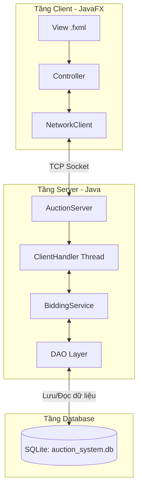
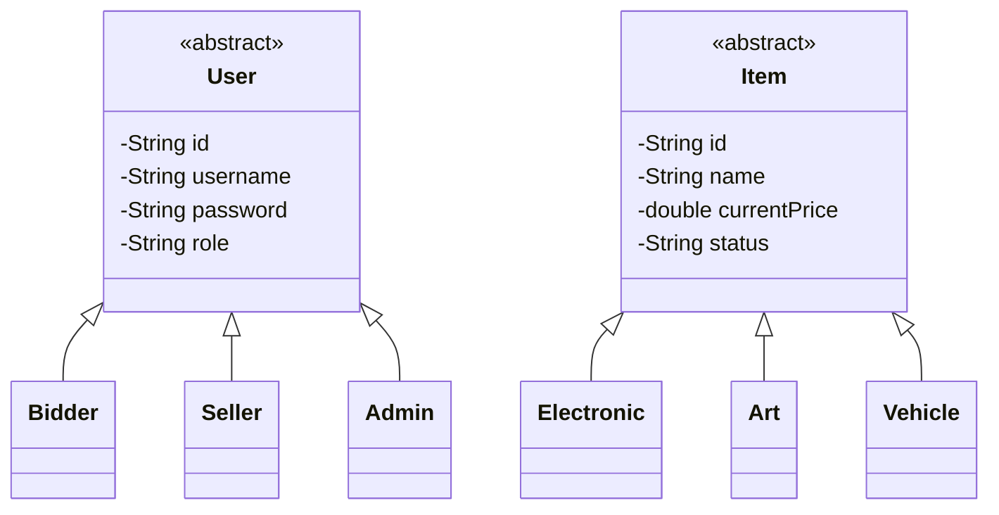

# Bài Tập Lớn Nhóm 3 - Lập trình nâng cao
## 👥 Thành viên nhóm
- Lê Phú Thắng (25020399) 
- Phùng Sơn Vương (25020435)
- Đặng Minh Tâm (25020357)
- Nguyễn Thị Hồng Nhung (25020305)
##  Mục tiêu dự án
- Mục đích: Phát triển hệ thống đấu giá trực tuyến
## Phân chia công việc 
- ### Lê Phú Thắng:
   Quản lý Người dùng và Sản phẩm, thiết kế giao diện chính cho hệ thống. (3.1.1, 3.1.2, 3.1.6)

- ### Phùng Sơn Vương:
  Thiết kế khung MVC, Networking, áp dụng Design Pattern và quản lý việc trộn code (Merge).

- ### Đặng Minh Tâm:
  Xử lý đặt giá đồng thời (Concurrency) và thuật toán chống bắn tỉa (Anti-sniping).

- ### Nguyễn Thị Hồng Nhung:
  Đấu giá tự động, cập nhật Realtime và vẽ biểu đồ lịch sử giá. 

# Mô tả hệ thống

## 1. Mô tả bài toán & Phạm vi
Hệ thống đấu giá thời gian thực hoạt động theo mô hình Client-Server giao tiếp qua TCP Socket.
* **Người mua (Bidder):** Đặt giá, dùng Auto-Bid, xem số dư.
* **Người bán (Seller):** Tạo sản phẩm, quản lý phiên đấu giá.
* **Quản trị (Admin):** Quản lý tài khoản và duyệt sản phẩm.

## 2. Công nghệ sử dụng
* **Backend:** Java 21, TCP Socket, SQLite, Gson.
* **Frontend:** JavaFX 21 (mô hình MVC), SceneBuilder.
* **Công cụ:** Maven 3.9, JUnit 5, GitHub Actions (CI/CD).

## 3. Cấu trúc module chính
* `client/`: Xử lý giao diện (View/Controller) và gửi/nhận tín hiệu (NetworkClient).
* `server/`: Quản lý luồng (ClientHandler), logic đấu giá (BiddingService) và CSDL (DAO).
* `shared/`: Các thực thể dùng chung (User, Item, BidTransaction,...).

## 4. Hướng dẫn khởi chạy (Đa nền tảng)
**⚠️ THỨ TỰ BẮT BUỘC:** Khởi chạy Server trước, sau đó mới khởi chạy Client.

Mở Terminal tại thư mục chứa file `pom.xml`:

**1️⃣ Chạy Server:**
* **Windows:** `mvn exec:java -Dexec.mainClass="com.auction.server.network.AuctionServer"`
* **Mac/Linux:** `./mvnw exec:java -Dexec.mainClass="com.auction.server.network.AuctionServer"`

**2️⃣ Chạy Client:**
* **Windows:** `mvn javafx:run -Djavafx.mainClass="com.auction.client.Launcher"`
* **Mac/Linux:** `./mvnw javafx:run -Djavafx.mainClass="com.auction.client.Launcher"`

## 5. Chức năng nổi bật đã hoàn thành
* Áp dụng OOP chuẩn mực và Design Patterns (Singleton, Factory, Observer).
* Xử lý Đấu giá Real-time đồng thời (Concurrency) chống xung đột dữ liệu bằng `synchronized`.
* Hệ thống Auto-Bidding tự động đè giá đối thủ.
* CI/CD pipeline tự động build và Unit Test với code coverage cao.

## 6. Liên kết đính kèm
* **Báo cáo PDF:** https://drive.google.com/file/d/1gJsTrV91Xv497tZvQrnV22VB1GMNfXPY/view?usp=sharing
* **Video Demo:** https://drive.google.com/file/d/1Sn0FYjhY0cXUsrvwRGr6cvE0I6t_VO9Y/view?usp=sharing

## 8. Sơ đồ hệ thống (Architecture & Class Diagram)

### Sơ đồ kiến trúc Client-Server

### Sơ đồ lớp (Class Diagram) cơ bản

